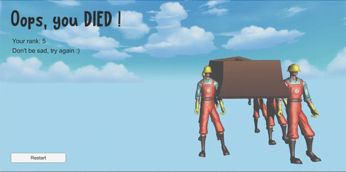

## README

*Game name: Huoxialai*(which means stay alive in Chineses)   *游戏名字：活下来* 

Development members: [Jiang Li](https://github.com/RiverLeeGitHub), [Qinhang Li](https://github.com/Sailorlqh), Xia Gong

### Introduction

This is a survival action game. Enemies, weapons and props are distributed in the game scene. The player need to pick up weapons or props to attack or protect itself. The game is designed with a safe zone, and characters will continuously get hurt when outside this zone. The player wins after defeating all enemies. If the player's health is damaged to 0, the game is lost.

这是一个生存动作游戏， 敌人、武器和道具随机分布在游戏场景中。 玩家需要拿起武器或道具来攻击敌人或保护自己。 游戏有毒圈设计，角色在该区域外时将不断受到伤害。 击败所有敌人后，玩家获胜。 如果玩家的生命值降低为0，游戏将会失败。

此项目为我们的游戏课课程设计，原说明为英文未能尽然翻译，抱歉抱歉

### Demonstration

* The role is idling in the scene, with a wrench holding in his hand.  角色设定为一个不甘平凡的修理工，手握扳手意气风发

  

* This is how the game starts.   游戏的打开方式

  

* Player and NPCs can pick up weapons to attack others or take drug to cure themselves.  玩家与其他修理工可以拾捡武器来攻击对方，或者喝药治疗

  

* Magic attack is available!  魔法攻击！

  

* Your blood will decrease when standing outside the safezone.  跑到毒圈外会提示并扣血

  

* The game ends when you die.  当角色死亡后游戏结束

  

  

### Scripts

* GameManager.cs  // Compute global static variables and control swiching scenes
* Sound/SoundManager.cs  // Control playing audios

* Environment/Environment.cs  // Generate environments and safe zone

* NPC/NPCMovement.cs  // Control NPC movements, states, health bar, death, AI, etc.

* NPC/predictPlayerMovement.cs  // For NPC to predict player's movement
* Player/PlayerMovement.cs  // Control player movements, states, health bar, death
* UI/GameDisplay.cs  // UI of game scene
* UI/LoseDisplay.cs  // UI of lose scene
* UI/StartDisplay.cs  // UI of start scene
* UI/WinDisplay.cs  // UI of win scene
* Weapons/Drug.cs  // Function drug
* Weapons/Wrench.cs  // Control the weapon functions, pick up or attack, animation, etc.

### Responsibilities

* **Jiang Li**

  I mainly worked on the design of game rules and mechanics, as well as implementing the basic logics of the game, participating in making game object functions, animations, UI and audios.

  Here're the scripts I wrote:

  * Environment/Environment.cs
    * GenerateWeaponsOnGround(int amount)  // Generate weapons on the ground
    * GenerateNPCsOnGround(int amount)  // Generate NPCs on the ground
    * PoisonCircle()  // Shrink the safe zone circle randomly
  * NPC/NPCMovement2.cs
    * RandomDirectionChanged()  // Change direction randomly
    * DeathEffect()  // Generate bone after death, destroy itself
    * updateHealthBar()  // Update health bar
    * getSafeZoneCoord()  // Decrease health when outside safe zone
    * Jump()  // Implement the NPC's jumping physics with Euler ODE
    
  * Player/PlayerMovement.cs
      * Update()  // Keyboard control
      * Jump()  // Implement the player's jumping physics with Euler ODE
      * DeathEffect()  // Generate bone after death, destroy itself
      * updateHealthBar()  // Update health bar
      * CheckInSafeZone()  // Check if player is outside safe zone, lose health and set alert
  * Weapons/Wrench.cs
    * OnTriggerEnter(Collider other)  // Attack event
    * OnCollisionEnter(Collision other)  // Pick up or attack events
    * PlayAnimation()  // play animation of specified weapon
  * Weapons/Drug.cs
  * Sound/SoundManager.cs
  * UI/GameDisplay.cs
  * UI/LoseDisplay.cs
  * UI/StartDisplay.cs
  * UI/WinDisplay.cs
  
* **Xia Gong**

  I'm responsible for weapons and animations of the players and NPCs. I searched for the materials and animations that can be use to perform an attacking action for the player and NPCs. Also I'm responsible for the in-game animation system.

  Here're the scripts I wrote:

  * NPC/NPCMovement.cs  and Player/PlayerMovement.cs
    * Throw() // perform throwing action
    * Cast() // perform magic casting action
    * getHurt() // get hurt and lose health
    * hurt() // an coroutine that display the hurt animation
  * Weapons/Wrench.cs  // Control the weapon functions, pick up or attack, animation, etc.
    * GetAttackMode() // Returns if the weapon is being  used to attack
    * RangeAttack() // Perform magic Attack
    * selectTarget() // Find nearest target around the weapon holder to attack
    * ThrowMe() // Start a throwing status of a throwing star
  
* **Qinhang Li**

    I'm responsible for the movement of NPCs and AI for NPC to predict player's movement.  Also, I am responsible for finding the asset of the game scene and generate them and participating in making the audio part. 

    And I am also responsible for recoding the video, and the narrative of the video.

    * Environment/Environment.cs
      
      *  Generate() //Generate the ground(i.e. the mountains)
      *  GenerateNatureObjects(int amount) //Generate trees, grass, etc.
      
    * NPC/NPCMovement.cs

      * increaseWeaponNum() //increase number of weapons that NPC is holding
      * decreaseWeaponNum() //decrease number of weapons that NPC is holding
      * findNearByWeaponIndex() //return -1 if no weapon nearby, or the index of the weapon
      * getNearByWeaponByIndex() //get the weapom object that the NPC find.
      * NPCMovementWhenOutsideofSafeZone(Vector3 safeZonePos) //control the movement of NPC when is get outside of the safe zone
      * NPCMovementNoWeapon(float distanceToPlayer) //control the movement of NPC when it doesn't hold any weapon
      * NPCMoveMentWithWeapon(flaot distanceToPlayer) //control the movement of NPC when it holds a weapon
      * getSafeZoneCoord() //get the center coordniate of the safe zone
      * ManagerNPCPosQueue(Vector3 NPCPos) //store the movement of NPC
      * ManagePlayerPosQueue(int index, int method) //store the movement of player when the NPC sees the player
      * NPCIsStuck() //check if NPC got stucked
      * predict(List<float> playerCoordnate, int num) //Call functions in the predictPlayerMovement.cs to predict player's movement.

    * NPC/predictPlayerMovement.cs

      This cs file implements a polynomical regression, to predict the movement of the player.

\* Some functions are written by one more group members. So it's hard to distinguish them all.